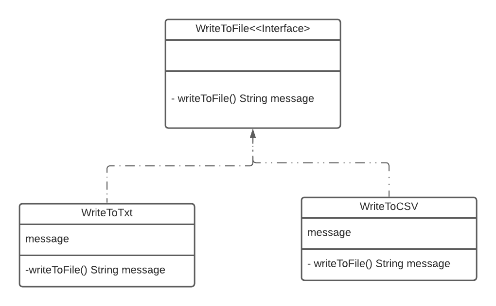
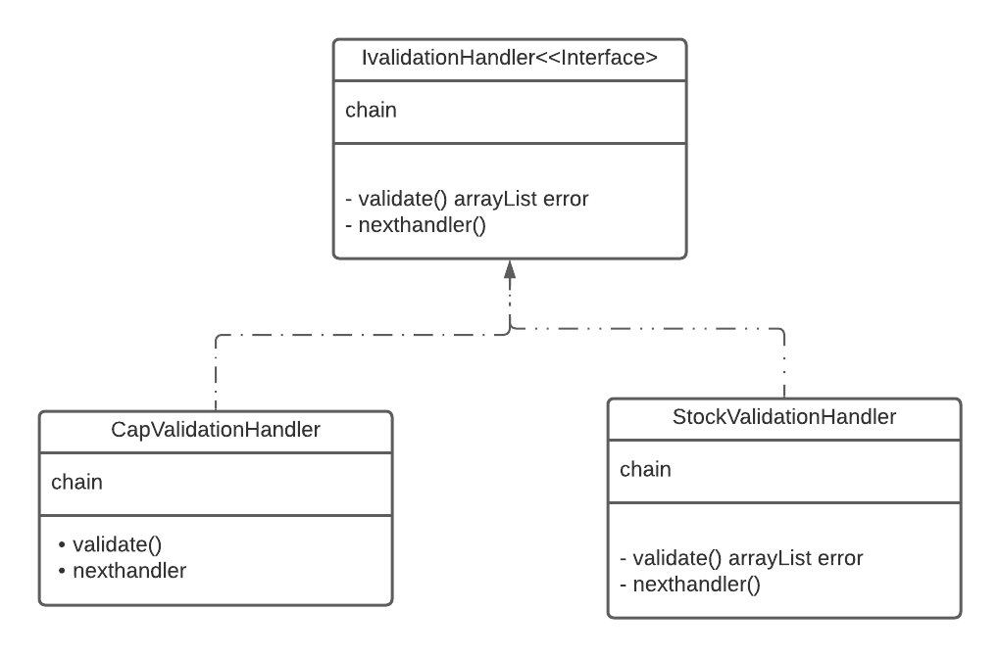
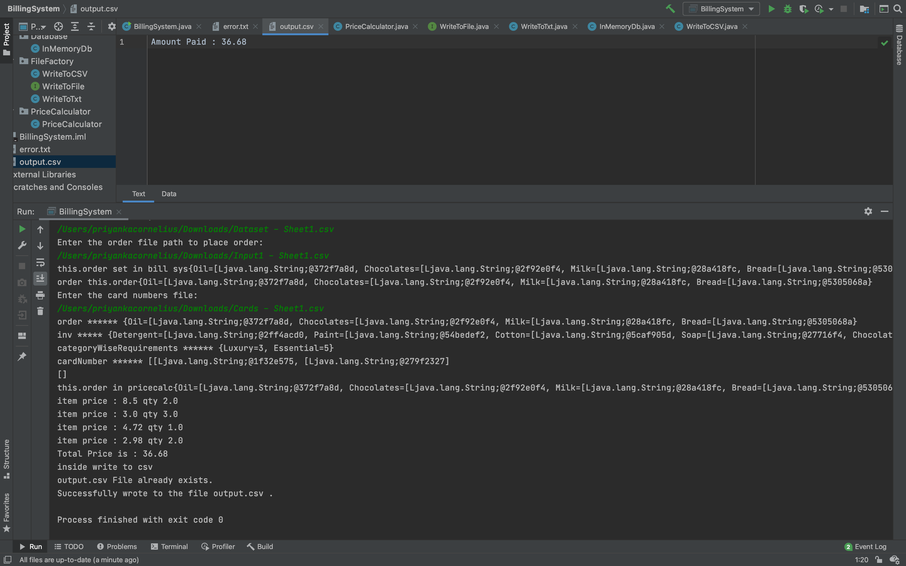
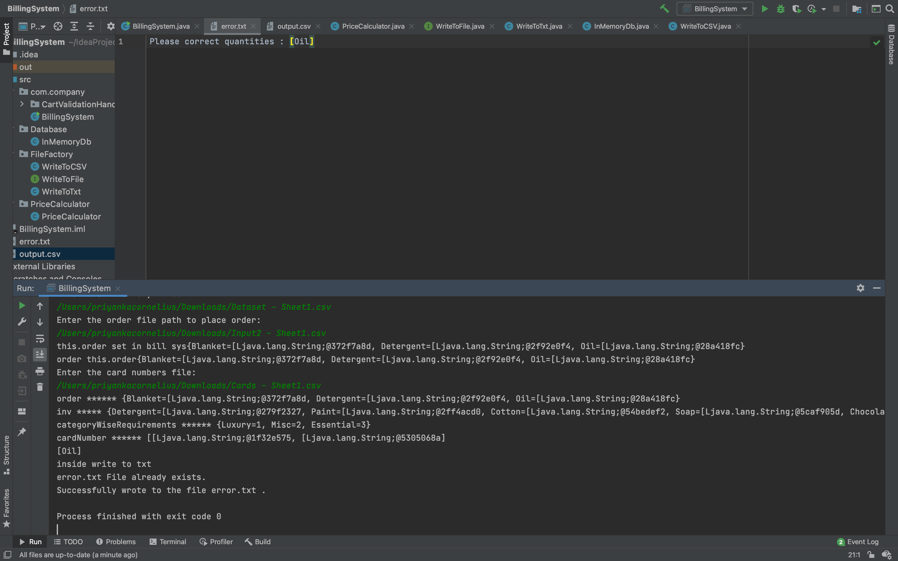
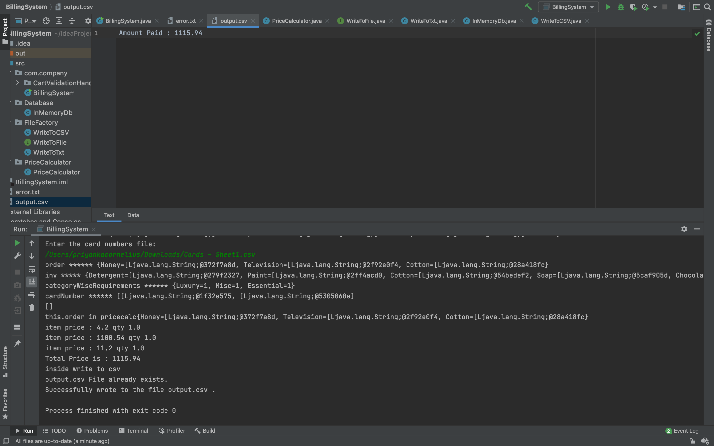
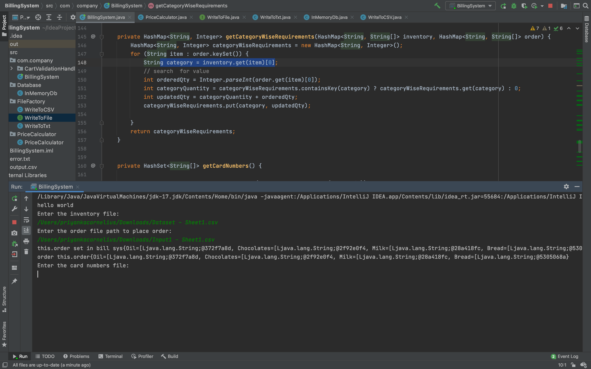
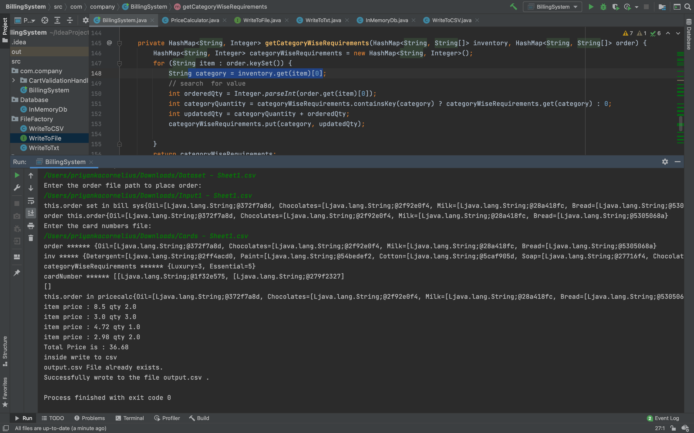

# Inventory-Management-System

## Introduction

The Inventory Management System is a java application that takes inventory list, customer order and payment method as input, verifies the order against available stock in the inventory, and calculates the bill.
#### **Input files(in CSV format)**
* **Inventory** contains a list of items in the stock, their respective Category (e.g. Dairy, Beverage, Bakery etc.), and the count of items permissible to buy from each category.
* **Customer Order** contains a list of items and their required quantities.
* **Card Numbers** is a list of all previous customers' card numbers.

## Problem Statement
* Customer's order should be checked against the inventory for insufficient stock availability and an error file with 'out of stock' message should be returned.
* The inventory has items from several categories and the user is allowed to buy only a specifc number of products from each category available. For orders requesting more than the permissible quantities, an error file with 'limited availability' message should be returned.
* The system should check if the customer's payment method details exist in the database already, and add them to the database if not.
* The order should satisfy the given requirements, and if it does, a bill amount should be generated in an output.csv file, else error messages should be generated in error.txt file. 

## Design Patterns Used
### 1) Factory Design Pattern
Factory Method is a creational design pattern that provides an interface for creating objects in a superclass, but allows subclasses to alter the type of objects that will be created. The factory method design pattern is used to create Invalid orders error file and the correct order bill amount output file since there are different types of file formats that need to be written to in different scenarios, but they have the same implementation and behaviour.
 
Factory Method UML Diagram-

### 2) Chain of Responsibility
Chain of Responsibility passes requests along a chain of handlers. Upon receiving a request, each handler decides either to process the request or to pass it on to the next handler in the chain. Chain of Responsibility has been used to perform 'Insufficient Stock' validation, 'Order quantity below Category Cap' validation and 'Payment Method exists in database' validation in sequential order by chain handlers.
 
Chain of Responsibility UML Diagram-

## Output Screenshots
### Output Generated for Input File1

### Error Generated for Input File2

### Output Generated for Input File3

### Input File Requirements

### Calculation Logs

